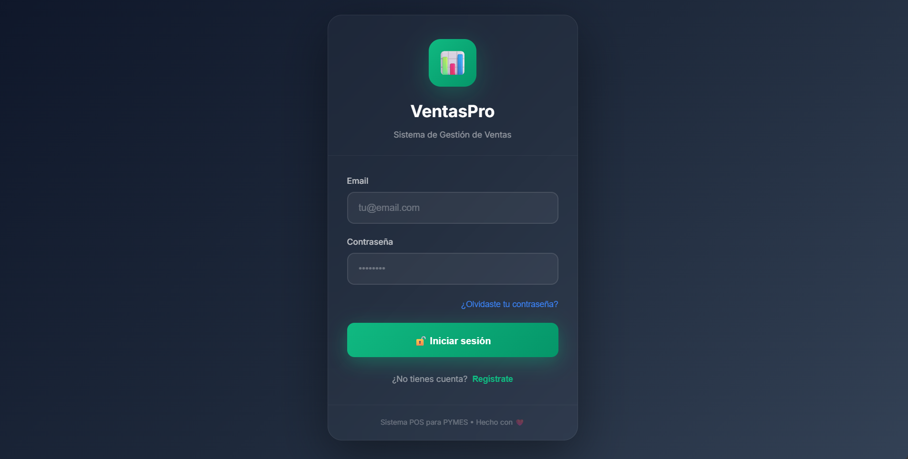
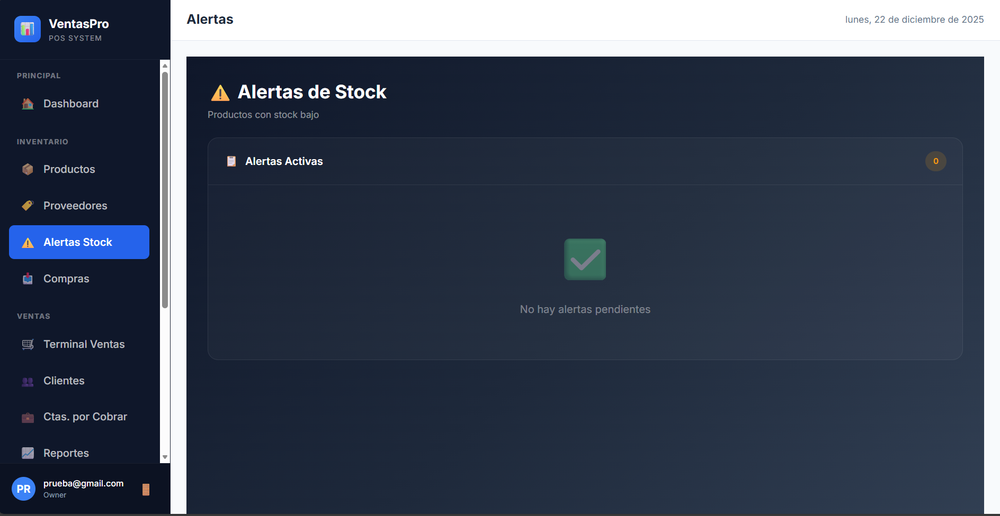
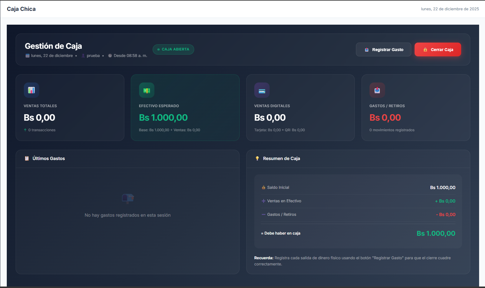

# 🚀 VentasPro - Sistema Integral de Gestión para PYMES

<p align="center">
  
</p>

<p align="center">
  
  
  
  
</p>

---

## 🌟 Sobre el Proyecto

**VentasPro** es una solución tecnológica diseñada específicamente para pequeñas y medianas empresas (PYMES) que buscan modernizar su operación comercial. Este sistema centraliza el control de ventas, inventario, finanzas y clientes en una plataforma web intuitiva, rápida y segura.

### ❓ ¿Por qué se creó este proyecto?
Muchos negocios locales aún dependen de registros manuales o herramientas obsoletas que provocan pérdida de información y descuadres financieros. **VentasPro** nace para:
- **Optimizar el tiempo**: Automatizando el registro de ventas y la generación de recibos.
- **Control Total**: Ofreciendo visibilidad en tiempo real del stock y las ganancias.
- **Seguridad**: Protegiendo los datos mediante autenticación robusta y roles de usuario.
- **Decisiones Basadas en Datos**: Proporcionando analíticas detalladas para entender mejor el rendimiento del negocio.

---

## ✨ Características Principales

| Módulo | Descripción |
| :--- | :--- |
| **📦 Inventario** | Gestión inteligente de stock con alertas de nivel mínimo. |
| **🛒 Punto de Venta (POS)** | Terminal de ventas rápido con soporte para múltiples métodos de pago (Efectivo, QR, Tarjeta). |
| **📊 Reportes & Analítica** | Gráficos interactivos sobre ingresos, productos estrella y tendencias. |
| **👥 Clientes & Créditos** | Seguimiento de cuentas por cobrar y fidelización de clientes. |
| **🔐 Auditoría** | Registro detallado de cada acción realizada en el sistema para máxima transparencia. |
| **💼 Gestión de Caja** | Control estricto de aperturas, movimientos y cierres de caja chica. |

---

## 📸 Galería del Sistema

<table align="center">
  <tr>
    <td align="center"><b>Acceso Seguro</b><br></td>
    <td align="center"><b>Punto de Venta</b><br></td>
  </tr>
  <tr>
    <td align="center"><b>Análisis de Ventas</b><br></td>
    <td align="center"><b>Panel de Control</b><br></td>
  </tr>
</table>

---

## 🛠️ Stack Tecnológico

- **Frontend:** [React.js](https://reactjs.org/) + [Vite](https://vitejs.dev/)
- **Estilos:** [Tailwind CSS](https://tailwindcss.com/)
- **Base de Datos & Backend:** [Firebase Firestore](https://firebase.google.com/products/firestore)
- **Autenticación:** [Firebase Auth](https://firebase.google.com/products/auth)
- **Funciones Serverless:** [Cloud Functions for Firebase](https://firebase.google.com/products/functions)
- **Hosting:** [Firebase Hosting](https://firebase.google.com/products/hosting)

---

## 🚀 Instalación y Uso Local

1. **Clonar el repositorio:**
   ```bash
   git clone https://github.com/Stuwarth/SISTEMA-VENTAS.git
   cd SISTEMA-VENTAS/frontend
   ```

2. **Instalar dependencias:**
   ```bash
   npm install
   ```

3. **Configurar Firebase:**
   Crea un proyecto en [Firebase Console](https://console.firebase.google.com/) y añade tus credenciales en un archivo `.env` dentro de la carpeta `frontend/`.

4. **Iniciar entorno de desarrollo:**
   ```bash
   npm run dev
   ```

---

## 🤝 Contribuciones

Este es un proyecto abierto a mejoras. Si tienes alguna idea, no dudes en abrir un *Issue* o enviar un *Pull Request*.

---

<p align="center">
  Hecho con ❤️ para potenciar el crecimiento de las PYMES.
</p>
